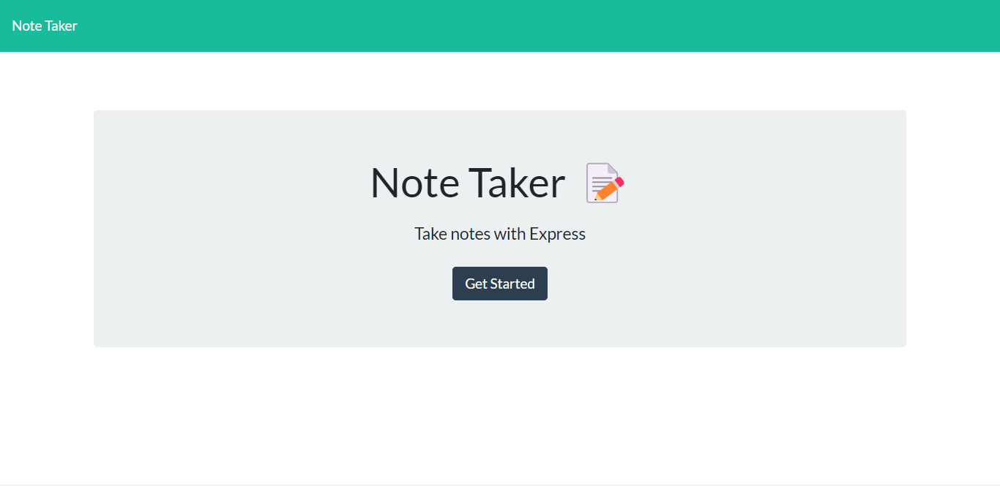
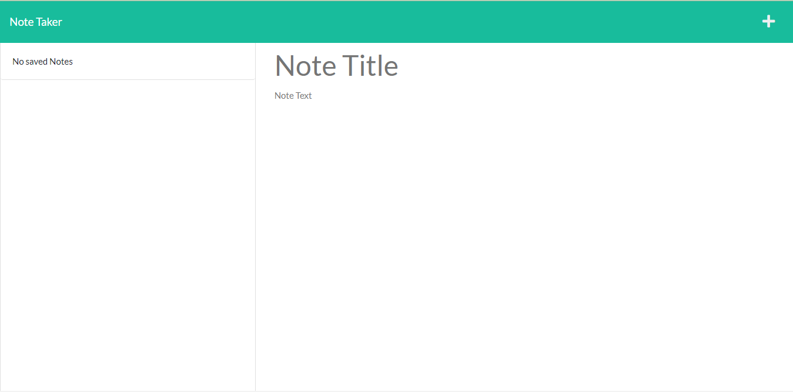
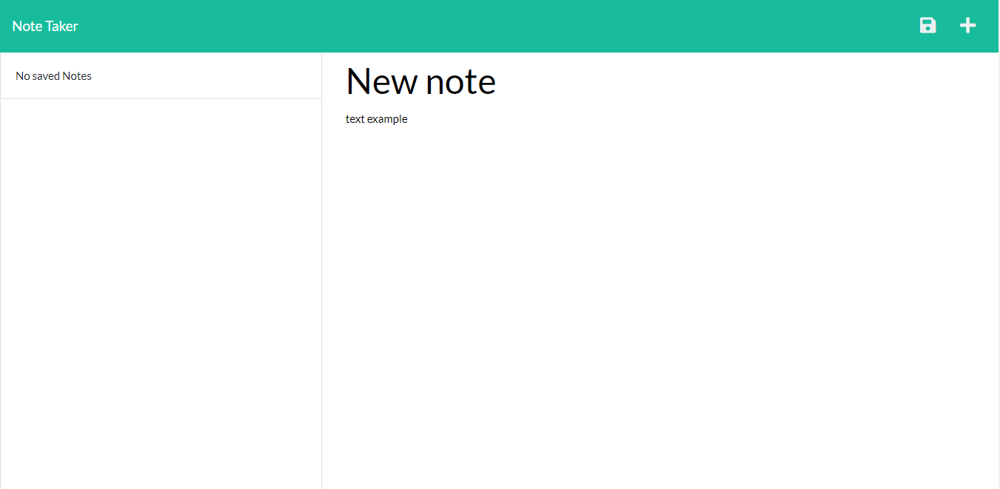
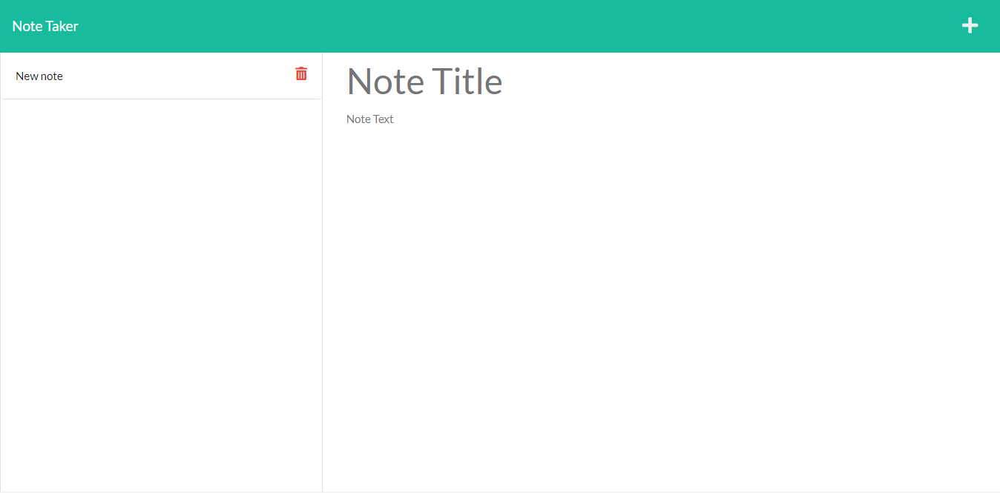

# Note taker

# Project Description

This application allows any user to create a list of notes in which they can write anything as well as delete it.

this application helps users remember tasks that need to be done. it doesnt matter if the task is for tomorrow or even for a week as it will be there unless the note is deleted

# Example images

 * Home page

 

 * Note page

 

 * Save note 

 to save a note click the save button on the top right corner

 

  * delete note

 to delete a note click the trash can to the right of the note you want to delete

 

# Deploy aplication link

link: https://note-taker-jgm.herokuapp.com/

# Questions

email: gomezjoaquin991@gmail.com

github: [joacogm12](https://github.com/joacogm12)

# License

Licensed under the [ISC](https://chooseaLicense.com/licenses/isc/) license